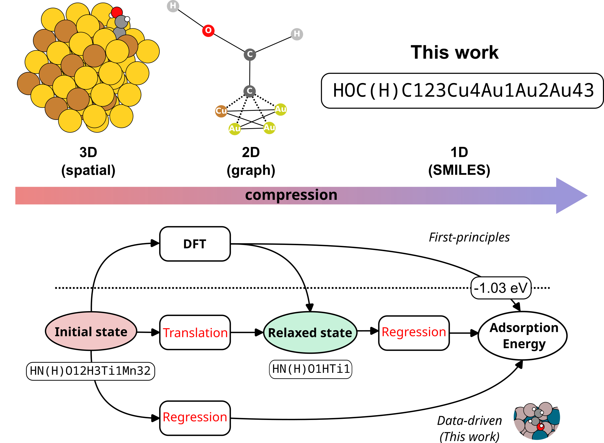

# Representing Adsorption with SMILES

    

     
    

This repo contains the code for training language models based on SMILES strings to represent adsorption structures. This work employs the Open Catalyst OC20 dataset.

## Install

## LICENSE
